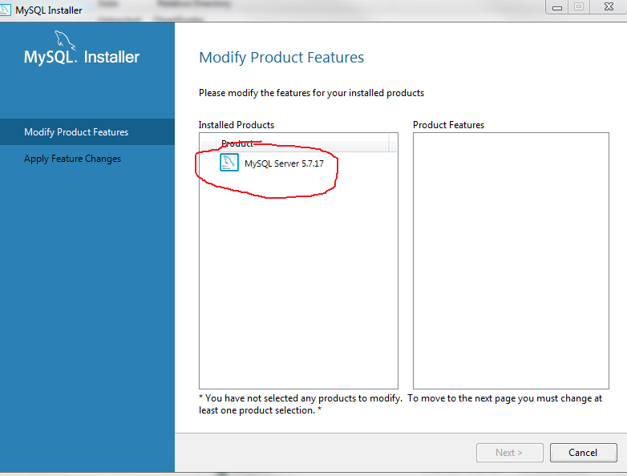
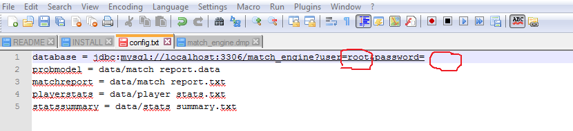
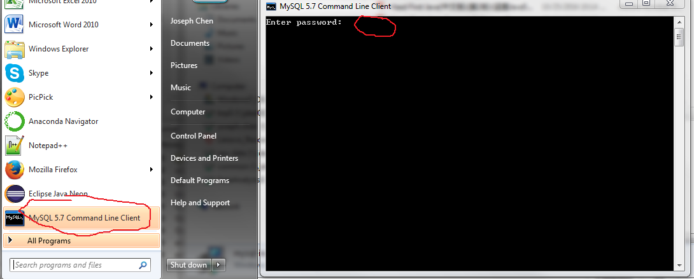
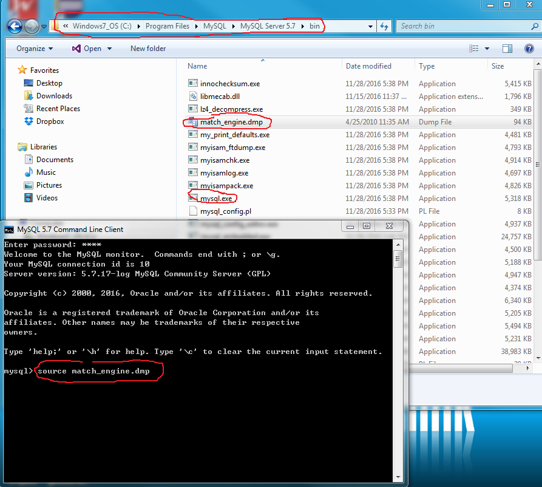

# OpenFootie

First of all, you should install the database from the MySQL dmp file "match_engine.dmp". It is assumed that you are already familiar with such tasks and that you have a MySQL database in your desktop. If not, or you don't want to be involved with MySQL, you can download the source code from the trunk and run the test.HardcodedMatch file. Of course, you would need to build the application in that case which can be more or less troublesome than installing MySQL and the application database. I have no specific instructions for building the project. If you load the project in Eclipse it should run fine, but I have not tried any other method of building and running yet.

In the "config.txt" file, set the "database" variable to your database address. A sample address is provided, but, of course you should have to tweak it to your personal settings. In this file, the "probmodel" file (containing the actual definition of the match engine; the java code is just an interpreter which generates the different matches based on that definition) and the three "log" files containing match report and statistics are also defined. 

After you have done all these preliminary settings, running the engine on your desktop is simple: 

							java -jar MatchRun.jar <home-team-id> <away-team-id>

where <home-team-id> and <away-team-id> are the database ids of the opponent teams.

## Install Database
1. Go to https://dev.mysql.com/downloads/mysql/ and download the mysql installer
 

2. Install MySQL Server, and set **password** to root user (user`root` and the password are to be used in config.txt)
 
 

3. Open MySQL command line Client, and Enter the **password** as you just set for `root` user.
 

4. Copy the match_engine.dmp file to directory where mysql.exe is located (in this example, C:/Program Files/MySQL/MySQL Server 5.7/bin), and then run **source match_engine.dmp** in the MySQL command line client as shown below.
 
